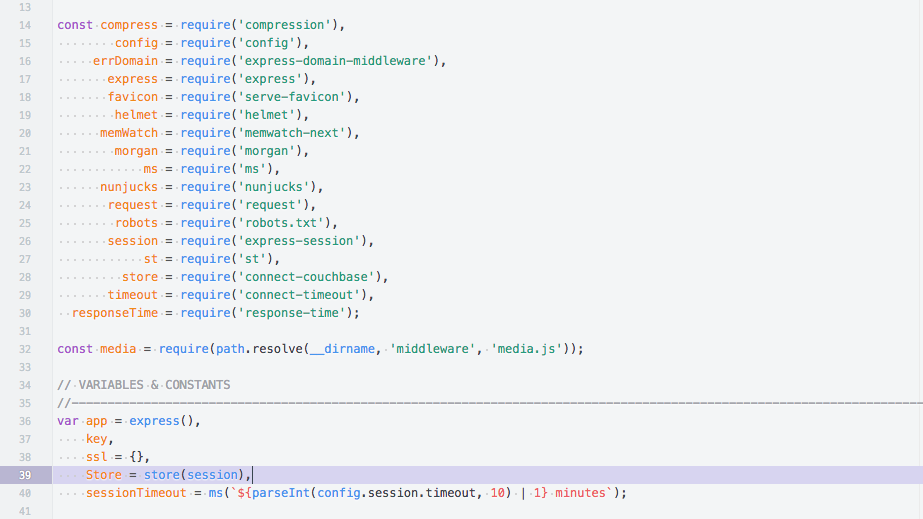

JSFiddle Light Theme for Brackets
============================

Inspired by [JSFiddle](https://jsfiddle.net)

# JSFiddle Light Theme for Brackets

Light color theme inspired by [JSFiddle](https://jsfiddle.net)

## Installation
* Open Brackets
* Open the Extension Manager
* Switch to "Themes" tab
* Search for "JSFiddle Light Theme"
* Click "Install"

## Screenshot

## Copyright and License
Copyright (c) 2016 [Kyle Wilson](https://github.com/waffledonkey). Released under the [MIT License](LICENSE).
